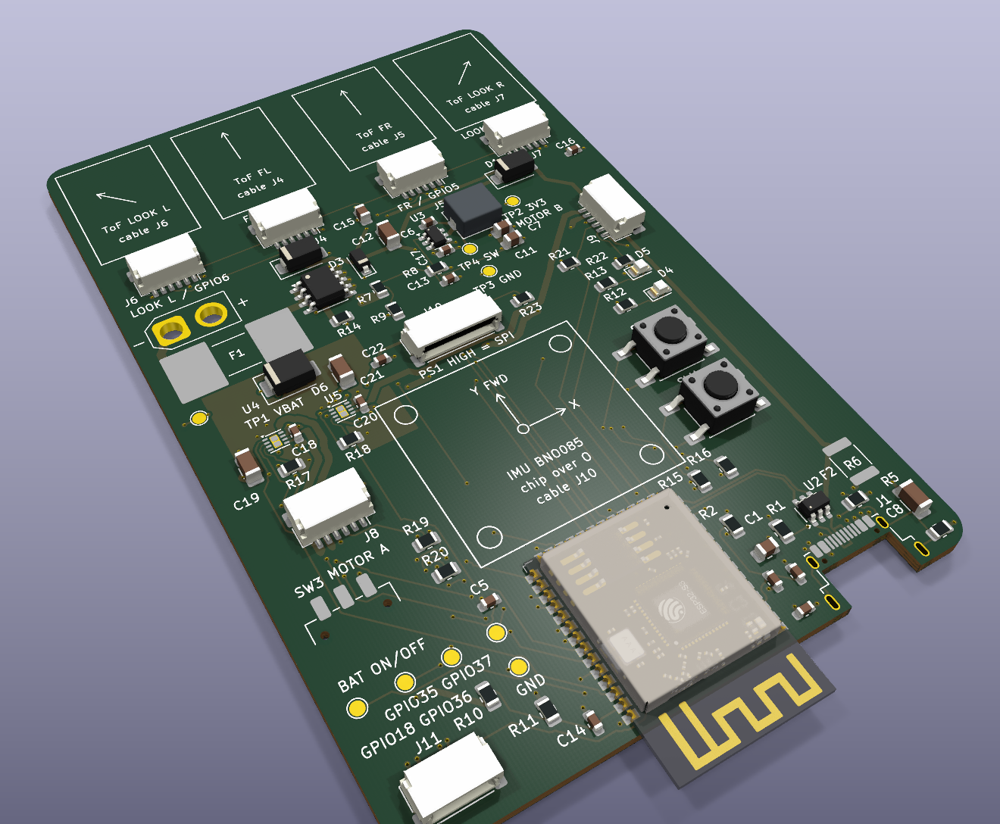
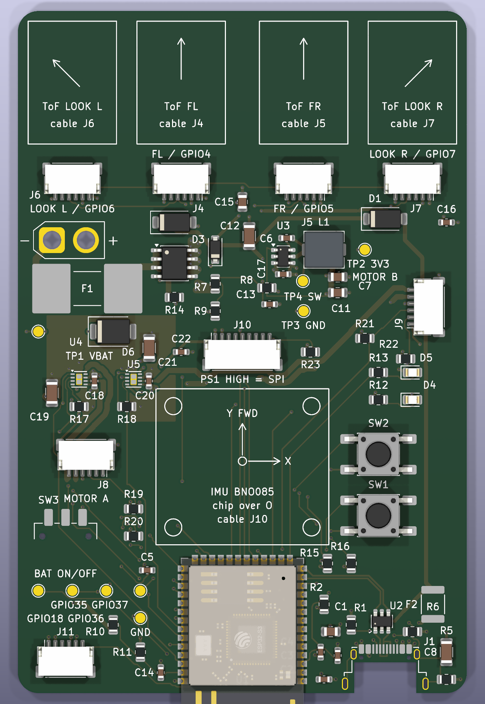
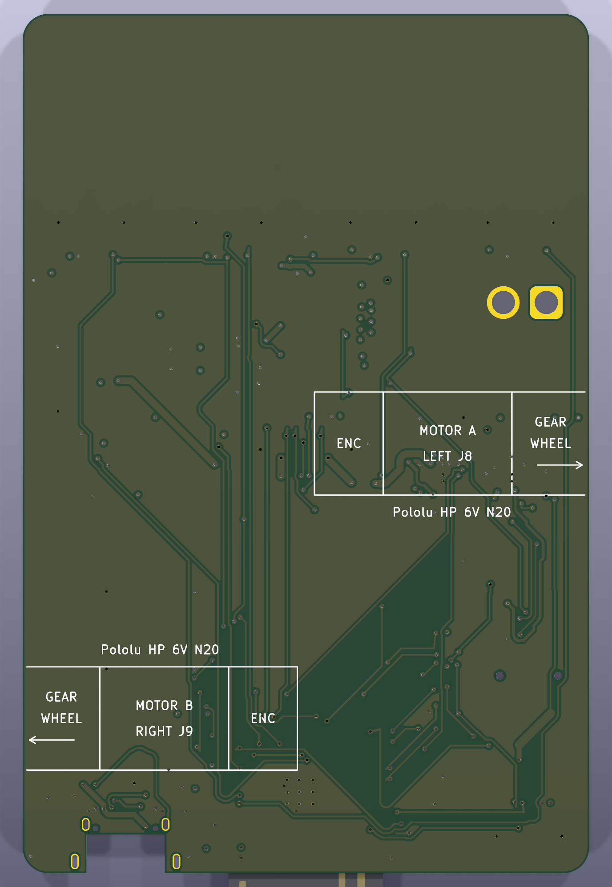
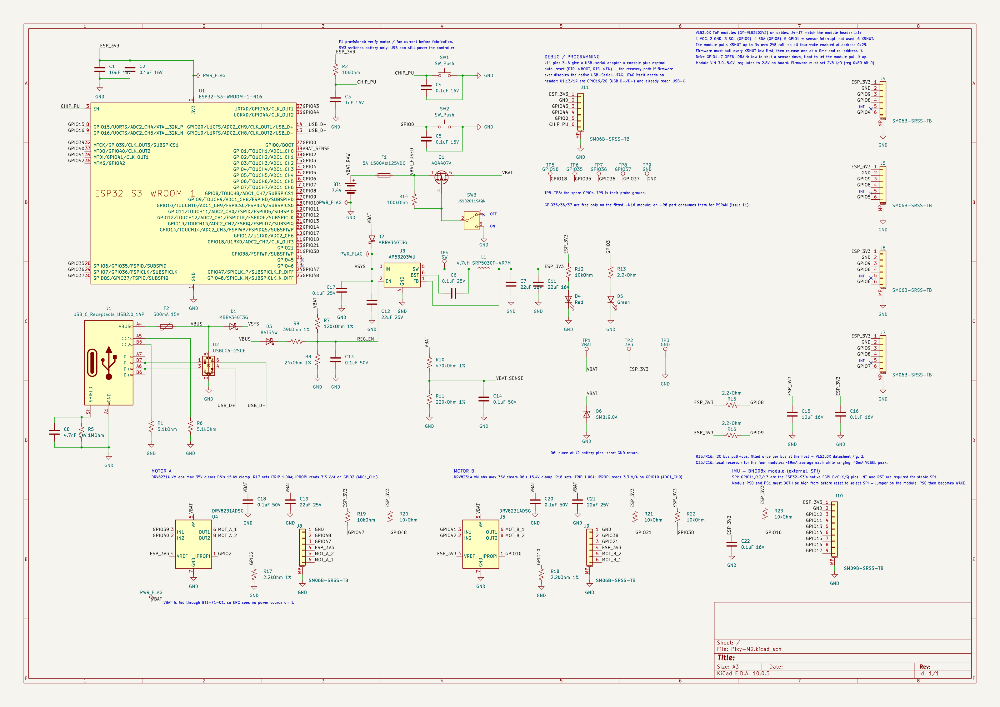
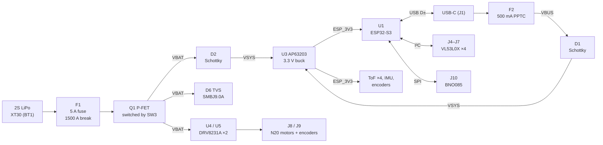
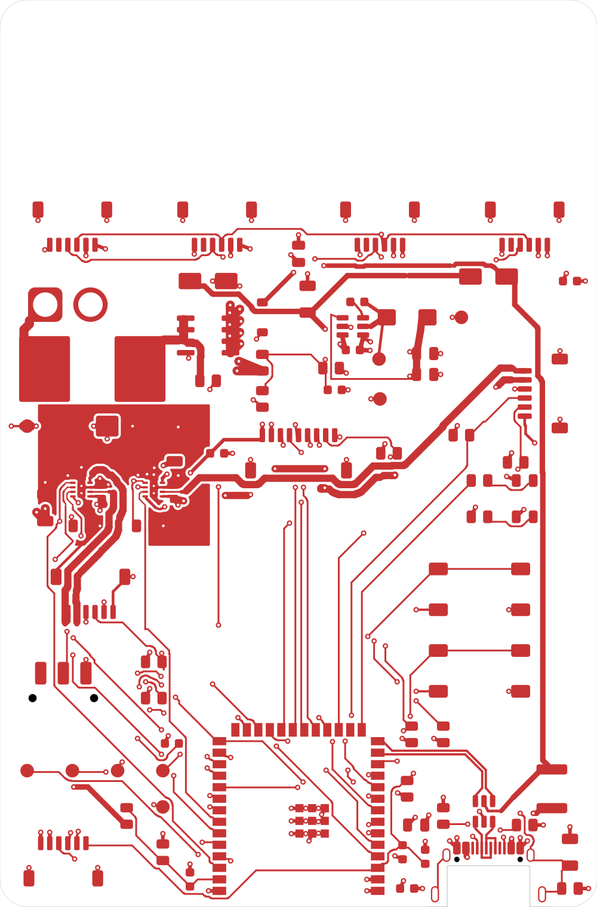

# Pixy-M2 — Micromouse Controller PCB

A single-board controller for a micromouse robot. The board carries an
**ESP32-S3** module, two **DRV8231A** motor drivers with current regulation,
a **2S LiPo** power path with fusing, switching and UVLO, a **3.3 V buck**,
and connectors for four **VL53L0X** time-of-flight wall sensors, a **BNO085**
IMU and two **Pololu N20** gearmotors with encoders.

Designed in **KiCad 10**. 4-layer, 66 × 100 mm, fully placed and routed.

<p align="center">
  
</p>

| | |
|---|---|
| **MCU** | ESP32-S3-WROOM-1-**N16** (16 MB flash, no PSRAM), Wi-Fi/BLE, native USB |
| **Power in** | 2S LiPo (7.4 V nominal, 8.4 V full) via XT30, or USB-C 5 V |
| **Logic rail** | 3.3 V, AP63203 2 A synchronous buck |
| **Motor drive** | 2 × TI DRV8231A H-bridge, 1.00 A hardware current limit, per-motor current sense into the ADC |
| **Sensors** | 4 × VL53L0X ToF (I²C), BNO085 9-DoF IMU (SPI), 2 × 12 CPR quadrature encoders |
| **Protection** | 1500 A-breaking battery fuse, USB PPTC, 600 W TVS on the motor rail, USB ESD array, hardware UVLO |
| **PCB** | 66 × 100 mm, 4 layers, 1.6 mm, 78 footprints, 253 vias, ~2.4 m of track |
| **Status** | Schematic complete, ERC 0/0. Layout routed, DRC 0 violations / 0 unconnected / 0 parity. **Not yet fabricated.** |

---

## Contents

- [Board renders](#board-renders)
- [Schematic](#schematic)
- [System architecture](#system-architecture)
- [Design decisions](#design-decisions)
- [Pin and connector reference](#pin-and-connector-reference)
- [PCB layout](#pcb-layout)
- [Parts list](#parts-list)
- [Repository layout](#repository-layout)
- [Working with the project](#working-with-the-project)
- [Bring-up notes for firmware](#bring-up-notes-for-firmware)
- [Status and open items](#status-and-open-items)

---

## Board renders

The top of each image is the **front** of the robot: the four ToF sensor
mounts face the maze walls ahead, and the ESP32-S3 antenna overhangs the rear
edge.

<table>
  <tr>
    <td align="center"><br><b>Top</b></td>
    <td align="center"><br><b>Bottom</b> (mirrored)</td>
  </tr>
</table>

The silkscreen prints where each off-board part attaches:

- **Top:** the four ToF mounts with their aim arrows and the connector each
  cable plugs into, and the BNO085 breakout outline centred on the robot's
  rotation centre.
- **Bottom:** the two Pololu HP 6V gearmotors, with the gearbox face on the
  board edge and the shaft on the wheel axle.

---

## Schematic

Single flat A3 sheet: [`Pixy-M2.kicad_sch`](Pixy-M2.kicad_sch).

[](docs/images/schematic.png)

---

## System architecture



### Power path

```
 BT1+ ── F1 ── VBAT_FUSED ── Q1 (S→D) ── VBAT ──┬── D2 ──┐
                   │            │                ├── U4/U5 motor drivers
                  R14           G                ├── R7/R8 UVLO divider
                   └────────────┤                ├── R10/R11 battery sense
                           SW3 (gate only)       └── D6 TVS to GND
                                                          ├── VSYS ── U3 buck ── ESP_3V3
 J1 VBUS ── F2 ── VBUS ── D1 ─────────────────────────────┘
                   ├── D3/R9 USB enable path
                   └── U2 ESD clamp reference
```

- **`VBAT`** is the switched, fused motor rail. Motor current does **not** pass
  through D2. D2 feeds only the buck input.
- **`VSYS`** is the diode-OR of battery and USB. It reaches **~8.1 V** on a
  full pack.
- **`ESP_3V3`** feeds the module, the four ToF sensors, the IMU, the encoders,
  the LEDs and the drivers' `VREF` pins.
- **USB alone runs the controller** with SW3 off. That makes bench work and
  flashing possible without a pack. There is no on-board charger; charge the
  pack separately.

---

## Design decisions

The full reasoning, including rejected alternatives and the measurements behind
each change, lives in [`CLAUDE.md`](CLAUDE.md). This section covers the main
choices.

### One board, no daughterboard

An earlier version put the motors, drivers and IMU on a daughterboard that
mated through two 22-pin headers. Those headers were the heaviest and tallest
parts after the module, and they carried motor return current through eight
ground pins. The design now puts everything on one 4-layer board. Motor
return current flows in a solid ground plane, and the robot loses the mass and
height of the headers. The headers were deleted only once every GPIO they
carried ended on a real part.

### Motor driver: TI DRV8231A

The driver has to survive what the TVS lets through, not just the 8.4 V pack.
D6 clamps `VBAT` at up to **15.4 V**, and that ruled out the usual micromouse
parts:

| Part | VM abs max | Verdict |
|---|---:|---|
| DRV8833 | 11.8 V | below the clamp: rejected |
| TB6612FNG | 15.0 V | below the clamp: rejected |
| DRV8874 / DRV8876 | 40 V | good, but no stock KiCad symbol |
| **DRV8231A** | **35 V** | **fitted**, 2.3× the clamp |

The DRV8231A also:

- runs down to **4.5 V**, which covers the whole usable pack range;
- has **internal 100 kΩ pulldowns on IN1/IN2**, so both motors stay off while
  the ESP32's GPIOs float at reset;
- needs no nSLEEP or nFAULT pin, which saves GPIOs;
- has **integrated current regulation and an `IPROPI` sense output**.

### Current limit: 1.00 A, set by the connector

```
ITRIP = VREF / (AIPROPI × RIPROPI) = 3.3 V / (1500 µA/A × 2.2 kΩ) = 1.00 A
```

J8/J9 use JST SH connectors so Pololu's own encoder cable plugs in 1:1. SH
contacts and that cable are rated **1 A**, so R17/R18 hold the limit there.
The limit still gives ~63 % of the motor's 6 V stall torque. It also bounds the
driver's dissipation: an unregulated stall at 8.4 V would draw ~1.9 A and put
the 2 × 2 mm WSON into thermal shutdown. `IPROPI` reads 3.3 V/A on an ADC1 pin
for each motor, so firmware can detect a stall and cut drive long before the
fuse matters.

### Battery fuse: one-time, 1500 A breaking

The chosen pack is a 2S 450 mAh 100C LiPo. Its estimated dead-short current is
**200–400 A**. The original 3 A PPTC could only break 40 A, so it was replaced
with a **Littelfuse 0885005.DR**: 5 A fast-acting, 1500 A breaking at
125 VDC. Normal worst-case load is ~2.4 A: both motors at the limit plus the
buck. Slow overload protection is now the job of the driver current limit and
firmware stall detection. F1 only opens on a real fault.

### Hardware undervoltage lockout

The buck's `EN` pin has a built-in comparator with switched hysteresis. A 1 %
divider (R7/R8) on `VBAT` sets it to:

| | Pack voltage | Per cell |
|---|---:|---:|
| Turn on | 6.90 V | 3.45 V |
| Turn off | 5.94 V | 2.97 V |

A second path from `VBUS` (D3 + R9) holds `EN` high on USB alone, so the board
runs with no pack fitted. D3 is required. Without it, R9 becomes a pull-down
whenever a USB cable from an unpowered host is plugged in, and the board will
not start on battery. Firmware still does the accurate low-voltage cutoff; the
hardware UVLO is the backstop for when firmware is not running.

### Battery sense without a gate FET

`VBAT` → 470 kΩ / 220 kΩ → GPIO1 (ADC1_CH0), with a 100 nF reservoir cap.

- The divider draws 12 µA, well under the 58 µA of the UVLO divider, which
  cannot be gated. A gate FET would save almost nothing.
- A low-side gate would have been harmful: the sense node floats up into the
  GPIO clamp.
- A full-pack reading sits at 2.68 V. Even a badly overcharged 9.5 V pack reads
  3.03 V, still inside the ADC's range.
- Both dividers are downstream of Q1, so SW3 OFF removes their drain on the
  pack.

### Buck converter

- The **AP63203WU** is a fixed 3.3 V part, so it needs no feedback divider.
- **L1 is a Bourns SRP5030T-4R7M** (Isat 6 A, 53 mΩ). It replaced an 0805
  inductor that would have saturated at a few hundred mA.
- **C17 straddles the package under U3**, across IN and GND, which is the
  tightest input loop the pinout allows. C12 (22 µF 25 V 1206) is the bulk. It
  keeps ~11–13 µF at 8.4 V bias, which meets the datasheet's 10 µF effective
  input capacitance.
- **The switch node is 3.57 mm² of top copper with no vias.** TP4 hangs off it
  as a short stub.

### OR-ing diodes

D1 and D2 are the same **onsemi MBRA340T3G** (40 V, 3 A, SMA). D2 carries
only the buck's input, ~0.43 A worst case, so an ideal-diode controller is not
worth it. The 40 V rating covers the 15.4 V TVS clamp reaching `VSYS`.

### IMU on SPI, not I²C

The BNO085 could have shared the ToF I²C bus on throughput alone. It was put
on its own SPI bus for **latency**: an IMU interrupt that arrives mid-way
through a ToF read would wait up to ~150 µs, which is 15 % of a 1 kHz control
period. SCK, MOSI and MISO are on the ESP32-S3's native FSPI pins, so they go
through the IO MUX rather than the GPIO matrix. INT and RST are wired because
the BNO08x needs both for stable SPI. WAKE shares a pin with PS0 on the module.

### Four ToF sensors on one I²C bus

Every VL53L0X powers up at address `0x29`, and the address is volatile. Each
sensor therefore gets its own XSHUT line (GPIO4–7), so firmware can release the
sensors one at a time and re-address them. R15/R16 (2.2 kΩ) are the only bus
pull-ups, placed near the host, as the datasheet recommends. J4–J7 use the
GY-VL53L0XV2 module's own header order, so the cable is a straight 1:1 loom.

### USB

- **Series resistors deleted.** The ESP32-S3 PHY is impedance-matched, and the
  extra pads would have broken the differential pair beside the connector.
- **U2 (USBLC6-2SC6) is turned 90°** so its flow-through pins face J1 and U1.
  The pair then runs J1 → U2 → U1 entirely on the top layer with no vias.
- **Pair geometry is 0.25 mm trace / 0.15 mm gap.** A 2-D field solver
  ([`tools/impedance/zdiff.py`](tools/impedance/zdiff.py)) gives 88–94 Ω on a
  JLC04161H-7628 stackup.
- **No JTAG header.** The built-in USB-Serial-JTAG over USB-C already provides
  flashing, console and debugging.

### Strapping pins

GPIO45 and GPIO46 carry explicit no-connect flags. Driving GPIO45 high at reset
sets the flash rail to 1.8 V and the board will not boot. GPIO46 high with
GPIO0 low is an invalid boot combination. GPIO3 is the safe one of the three,
and drives the green status LED active-high, so its reset state stays low.

### Capacitor ratings

Every capacitor's voltage rating is in its Value field, so it shows on the
schematic. Two are worth pointing out:

- **C8** (USB shield) is **4.7 nF 1 kV in 1206**. An 8 kV ESD contact
  discharge puts ~250 V across it.
- **C19/C21** (motor bulk) are **22 µF 25 V** because of the 15.4 V TVS clamp.

---

## Pin and connector reference

### GPIO allocation

All 23 GPIOs left free after the core functions are used; four are spares on
test pads.

| Function | GPIO |
|---|---|
| USB D− / D+ | 19 / 20 |
| Boot button (SW2), also J11 | 0 |
| Battery sense (ADC1_CH0) | 1 |
| Status LED (green, active high) | 3 |
| ToF XSHUT 1–4 (J4–J7) | 4, 5, 6, 7 |
| I²C SDA / SCL (ToF bus) | 8 / 9 |
| Motor A IN1 / IN2 | 39 / 40 |
| Motor B IN1 / IN2 | 41 / 42 |
| Motor A / B current sense (IPROPI, ADC1) | 2 / 10 |
| Encoder A: OUT A / OUT B | 47 / 48 |
| Encoder B: OUT A / OUT B | 21 / 38 |
| IMU SPI SCK / MOSI / MISO / CS | 12 / 11 / 13 / 14 |
| IMU INT / RST / WAKE (PS0) | 15 / 16 / 17 |
| Debug UART0 TX / RX (J11) | 43 / 44 |
| Spare, on TP5–TP8 | 18, 35, 36, 37 |
| Strapping, deliberately no-connect | 45, 46 |

### Connectors

All the signal connectors are **JST SH 1.0 mm side-entry**.

**J4–J7: VL53L0X ToF sensors** (`SM06B-SRSS-TB`, GY-VL53L0XV2 header order)

| Pin | 1 | 2 | 3 | 4 | 5 | 6 |
|---|---|---|---|---|---|---|
| Signal | **VCC 3.3 V** | GND | SCL | SDA | INT (NC) | XSHUT |

> ⚠️ Pin 1 is **VCC**, not GND. A cable built "the usual way round" puts
> 3.3 V on the sensor's ground.

| Connector | Position | XSHUT |
|---|---|---|
| J4 | Front left (FL) | GPIO4 |
| J5 | Front right (FR) | GPIO5 |
| J6 | Look-ahead left, 45° | GPIO6 |
| J7 | Look-ahead right, 45° | GPIO7 |

**J8 / J9: motor + encoder** (`SM06B-SRSS-TB`, Pololu 12 CPR encoder order)

| Pin | 1 | 2 | 3 | 4 | 5 | 6 | MP |
|---|---|---|---|---|---|---|---|
| Signal | GND | OUT B | OUT A | VCC 3.3 V | M2 | M1 | GND |
| Pololu wire | green | white | yellow | blue | black | red | — |

J8 is motor A (left) and J9 is motor B (right). Use Pololu's straight SH–SH
encoder cable (#4765–#4769). R19–R22 pull the encoder outputs up to 3.3 V.

**J10: BNO085 IMU** (`SM09B-SRSS-TB`)

| Pin | 1 | 2 | 3 | 4 | 5 | 6 | 7 | 8 | 9 |
|---|---|---|---|---|---|---|---|---|---|
| Signal | VIN 3.3 V | GND | SCK | MOSI | MISO | CS | INT | RST | WAKE / PS0 |

> ⚠️ Jumper **PS1 high** on the module. Stock BNO08x breakouts ship in I²C mode
> and will not answer on SPI until it is changed.

**J11: debug / recovery** (`SM06B-SRSS-TB`)

| Pin | 1 | 2 | 3 | 4 | 5 | 6 |
|---|---|---|---|---|---|---|
| Signal | 3V3 (reference only) | GND | U0TXD | U0RXD | GPIO0 (BOOT) | CHIP_PU (EN) |

Pins 3–6 are an esptool auto-reset interface for a USB-UART adapter: DTR →
BOOT, RTS → EN. It is the way back in if firmware ever disables the native USB.

**Other**

| Ref | Part | Purpose |
|---|---|---|
| J1 | Amphenol 12401948E412A USB-C | Power, flashing, console, JTAG |
| BT1 | XT30U-M | 2S LiPo input |
| SW1 / SW2 | Tactile | Reset / Boot |
| SW3 | C&K JS102011SAQN slide | Battery ON/OFF (gate control only) |
| D4 / D5 | Red / green LED | Power (always on) / status (GPIO3) |
| TP1–TP4 | Test pads | VBAT, 3V3, GND, SW node |
| TP5–TP9 | Test pads | Spare GPIO18/35/36/37, probe GND |

---

## PCB layout

### Stackup

4 layers, 1.6 mm, designed for **JLC04161H-7628** (~0.2 mm L1–L2 prepreg).

| Layer | Use |
|---|---|
| **L1** F.Cu | Components, USB pair, buck switch node, motor-driver power loops, ground pour around the motor region |
| **L2** In1.Cu | **Solid, unbroken GND plane.** No signals, no splits. |
| **L3** In2.Cu | `ESP_3V3` pour plus a separate `VBAT` island under the motor region |
| **L4** B.Cu | Secondary routing plus a GND pour stitched to L2 |

The ground plane is never split. Noise is controlled by **placement**
instead. The motor drivers, the bulk capacitors, D6 and the battery entry
share the left-hand region. The MCU, ADC nodes and I²C sit away from it.

<p align="center">
  <br>
  <em>Top copper (F.Cu). The 0.8 mm motor trunks, the 1.0 mm battery path and the motor-region ground pour are on the left.</em>
</p>

### Layout highlights

- **Motor outputs** are 0.8 mm trunks. The only narrower copper is inside
  each driver's own pin field, and a custom DRC rule enforces that. Each pair
  runs together to its connector: the loop areas are **23.9 mm²** (A) and
  **9.8 mm²** (B).
- **Driver thermal pads** each have two filled-and-capped in-pad vias
  (IPC-4761 type VII) plus four more nearby. Only two fit a 0.9 × 1.6 mm pad
  under the hole-to-hole rule.
- **VM bypass caps** sit 1.33 mm from each driver's VM pin, across VM and GND.
  The loop closes in top copper with no plane hop.
- **Antenna keep-out**: the module's antenna overhangs the rear edge, with an
  all-layer copper keep-out defined as a board rule area.
- **Rules are encoded, not just followed.** Netclasses and
  [`Pixy-M2.kicad_dru`](Pixy-M2.kicad_dru) enforce:
  - motor trunk width;
  - USB width, layer and coupling;
  - power and battery path widths;
  - a 0.2 mm signal floor;
  - clearance floors keeping `REG_EN`, `VBAT_SENSE` and the IPROPI lines away
    from motor and switching copper.

  Each rule was tested by breaking a copy of the board and checking that DRC
  fired.

The board was routed by a purpose-written A* grid router
([`tools/autoroute/`](tools/autoroute/)) and then reworked in stages, each
driven by a design review. Every stage is scripted and reproducible. The review
findings and the evidence for each fix (DRC reports, measurements,
before/after images) are under [`layout/`](layout/).

---

## Parts list

A condensed list for **one board**. See **[`BOM.md`](BOM.md)** for the full
bill of materials: status of each part, cables, crimp contacts, off-board
modules, mechanical parts and tools.

### Active parts

| Qty | Ref | Part | Package |
|---:|---|---|---|
| 1 | U1 | Espressif **ESP32-S3-WROOM-1-N16**. It must be N16: `-R8` variants use GPIO35–37 for PSRAM. | Module |
| 2 | U4, U5 | TI **DRV8231ADSGR** motor driver | WSON-8 2×2 |
| 1 | U3 | Diodes Inc **AP63203WU-7** 3.3 V buck | TSOT-23-6 |
| 1 | U2 | ST **USBLC6-2SC6** USB ESD | SOT-23-6 |
| 1 | Q1 | AOS **AO4407A** −30 V P-FET. The schematic symbol is `IRF7404` for its pinout; order the AO4407A. | SOIC-8 |
| 2 | D1, D2 | onsemi **MBRA340T3G** Schottky | SMA |
| 1 | D3 | Vishay **BAT54W-E3-08** | SOD-123 |
| 1 | D6 | Vishay **SMBJ9.0A-E3/52** TVS | SMB |
| 1 | D4 | Red LED, high-efficiency | 0805 |
| 1 | D5 | Green LED | 0805 |

### Power passives, protection and switches

| Qty | Ref | Part | Package |
|---:|---|---|---|
| 1 | L1 | Bourns **SRP5030T-4R7M**, 4.7 µH, Isat 6 A | 5.0 × 5.0 mm |
| 1 | F1 | Littelfuse **0885005.DR**, 5 A, 1500 A breaking | NANO2 885 |
| 1 | F2 | Bourns **MF-MSMF050-2**, 500 mA PPTC | 1812 |
| 1 | SW3 | C&K **JS102011SAQN** SPDT slide | SMD |
| 2 | SW1, SW2 | E-Switch **TL3301NF160QG** tactile | 6 × 6 SMD |

### Connectors

| Qty | Ref | Part |
|---:|---|---|
| 1 | J1 | Amphenol **12401948E412A** USB-C |
| 1 | BT1 | AMASS **XT30U-M** |
| 7 | J4–J9, J11 | JST **SM06B-SRSS-TB** (SH, 6-pin) |
| 1 | J10 | JST **SM09B-SRSS-TB** (SH, 9-pin) |

### Capacitors (MLCC, X7R preferred)

| Qty | Ref | Value | Package |
|---:|---|---|---|
| 5 | C2, C4, C5, C16, C22 | 0.1 µF 16 V | 0603 |
| 2 | C6, C17 | 0.1 µF 25 V | 0603 |
| 4 | C13, C14, C18, C20 | 0.1 µF 50 V | 0603 |
| 1 | C3 | 1 µF 16 V | 0603 |
| 2 | C1, C15 | 10 µF 16 V | 0805 |
| 2 | C7, C11 | 22 µF 16 V | 0805 |
| 3 | C12, C19, C21 | 22 µF 25 V | 1206 |
| 1 | C8 | 4.7 nF **1 kV** | 1206 |

### Resistors (0805)

| Qty | Ref | Value |
|---:|---|---|
| 7 | R2, R12, R19–R23 | 10 kΩ |
| 3 | R13, R15, R16 | 2.2 kΩ |
| 2 | R17, R18 | 2.2 kΩ **1 %** (current limit) |
| 2 | R1, R6 | 5.1 kΩ (USB-C CC) |
| 1 | R5 | 1 MΩ |
| 1 | R7 | 120 kΩ **1 %** |
| 1 | R8 | 24 kΩ **1 %** |
| 1 | R9 | 39 kΩ **1 %** |
| 1 | R10 | 470 kΩ **1 %** |
| 1 | R11 | 220 kΩ **1 %** |
| 1 | R14 | 100 kΩ |

The resistors marked 1 % set the UVLO thresholds, the battery-sense ratio and
the motor current limit. Do not substitute 5 % parts.

### Off-board parts

| Qty | Item |
|---:|---|
| 4 | GY-VL53L0XV2 ToF module (silkscreen `HW-842`) |
| 1 | Adafruit BNO085 9-DoF breakout (#4754) |
| 2 | Pololu Micro Metal Gearmotor HP 6V with 12 CPR encoder (#5153–#5165 series; gear ratio not yet chosen) |
| 2 | Pololu SH–SH encoder cable (#4765–#4769) |
| 1 | 2S 450 mAh LiPo with XT30 (OVONIC 100C) |

### PCB fabrication options

- 4-layer, 1.6 mm, JLC04161H-7628 or equivalent.
- **Impedance control** on USB D+/D− (90 Ω differential), or confirm the
  geometry with the fab's calculator.
- **Via fill and cap (IPC-4761 type VII)** for the four thermal vias under
  U4/U5. The requirement is noted on `Dwgs.User`. Tenting is not a substitute.

---

## Repository layout

```
Pixy-M2.kicad_pro / .kicad_sch / .kicad_pcb   KiCad 10 project
Pixy-M2.kicad_dru                             custom DRC rules
Pixy-M2.pretty/                               project footprint library (U1 with antenna overhang)
fp-lib-table                                  registers the project library
BOM.md                                        full bill of materials
CLAUDE.md                                     full design notes: every decision, issue and measurement
REVIEW.md                                     layout design review
docs/images/                                  renders used in this README
layout/                                       placement notes, review evidence, DRC/ERC reports per fix
tools/autoroute/                              the grid router and scripted rework stages
tools/impedance/zdiff.py                      2-D field solver for the USB differential pair
DS_vl53l0x.pdf                                VL53L0X datasheet
```

`USB_C_Receptacle_Amazon.kicad_mod` in the root is **not used** by the board.
J1 uses the stock `Connector_USB:USB_C_Receptacle_Amphenol_12401948E412A`.

---

## Working with the project

Open `Pixy-M2.kicad_pro` in **KiCad 10**. The project library `Pixy-M2.pretty`
is registered through `fp-lib-table`. The Espressif footprint library
(`PCM_Espressif`) is only needed if you want to compare U1 against the stock
footprint.

### Checks

```sh
# Electrical rules
kicad-cli sch erc -o erc.rpt Pixy-M2.kicad_sch

# Design rules, with zone refill and schematic parity
kicad-cli pcb drc --schematic-parity --refill-zones --format json -o drc.json Pixy-M2.kicad_pcb

# Netlist, to diff after any schematic edit
kicad-cli sch export netlist --format kicadsexpr -o after.net Pixy-M2.kicad_sch
```

Current results: **ERC 0 errors / 0 warnings; DRC 0 violations, 0 unconnected
items, 0 schematic-parity issues.**

Always refill zones before DRC. Without a refill, every plane-connected pad
shows up as unconnected.

### Things that will silently break the design

- **Do not "Update Symbols from Library" on U4/U5.** The stock
  `Driver_Motor:DRV8231ADSG` symbol types OUT2 as `power_in`. The copy cached in
  this schematic fixes it to `output`. Updating reverts the fix and brings back
  two ERC errors.
- **Do not "Update Footprint from Library" on U1** back to `PCM_Espressif`.
  That restores antenna silkscreen that prints off the board edge.
- **Do not rotate U2 back** without re-routing the USB pair.
- **Keep "Signal minimum width" as the first rule in `Pixy-M2.kicad_dru`.**
  When two rules set the same constraint, the later one wins. Moving this rule
  below the motor, USB or power rules relaxes them to 0.2 mm.
- **Close KiCad before editing the files on disk.** A `~Pixy-M2.*.lck` file
  means the GUI has the project open, and whichever side saves last wins.

### Generating fabrication files

Gerbers, drill files and placement files are generated outputs and are
git-ignored. Export them from the PCB editor, or run:

```sh
kicad-cli pcb export gerbers -o gerbers/ Pixy-M2.kicad_pcb
kicad-cli pcb export drill   -o gerbers/ Pixy-M2.kicad_pcb
kicad-cli pcb export pos     -o gerbers/Pixy-M2-pos.csv Pixy-M2.kicad_pcb
```

---

## Bring-up notes for firmware

- **ToF sensors all wake at `0x29`.** GPIO4–7 float at reset and the modules
  pull XSHUT up, so all four sensors come up enabled at once. Firmware should
  first **drive all four XSHUT lines low**, then release one at a time and
  write a new address to register `0x8A`. The addresses are lost at every
  power cycle.
- **Drive XSHUT open-drain** (`GPIO_MODE_OUTPUT_OD`), not push-pull. The
  module's XSHUT sits on a 2.8 V rail.
- **Leave the VL53L0X driver's 2V8 I/O mode on.** It is the default in both ST's
  API and Pololu's library.
- **Motors sleep when IN1 = IN2 = 0.** The drivers' internal pulldowns keep
  them off until firmware drives the pins.
- **Cap motor PWM at ~71 % duty.** The N20s are 6 V motors on an 8.4 V pack;
  71 % gives a 6 V equivalent on a full pack.
- **Use IPROPI for stall detection** (GPIO2 / GPIO10, 3.3 V/A). The ADC clips
  at ~0.94 A, just under the 1.00 A limit, so a stall reads as full scale.
- **Battery sense:** use `ADC_ATTEN_DB_12`. Scale by 690/220 and calibrate once
  against a meter reading at TP1. Allow ~50 ms after a step change (15 ms RC),
  and average over whole PWM periods.
- **With USB connected, the hardware UVLO is bypassed.** Firmware must cut off
  a low pack itself in that case.
- **Keep ADC reads on ADC1.** Every analog input already is, because ADC2 is
  unusable while Wi-Fi is active.
- **Status LED:** drive GPIO3 **high** to light it.

---

## Status and open items

**Done:** schematic, placement, routing, the design-review rework, the DRC
rule set and the silkscreen assembly marks.

**Open before or during first fabrication:**

- [ ] **Mechanical design.** The drivetrain, wheel mounts, sensor brackets and
      battery strap are not designed. The PCB has **no mounting holes** yet.
      The battery reservation drawn on the board (40 × 30 mm) predates the
      chosen 62 × 17 mm pack.
- [ ] **Motor gear ratio.** Pick one for both motors. 12 CPR before gearing is
      low, so check that the ratio gives enough encoder edges for the control
      loop.
- [ ] **Current budget on real hardware.** Measure F1 temperature and U4/U5
      thermals during hard acceleration and stalls.
- [ ] **USB impedance.** Confirm 0.25 / 0.15 mm with the fab's calculator, or
      order impedance control.
- [ ] **`REG_EN` clearance.** The EN via under U3 is 0.40 mm from the switch
      pin. DRC stops it getting worse, but the intended fix, moving R8 and C13
      next to U3.2, is not done.
- [ ] **IPROPI traces** pass 0.53 mm from motor copper. Validate on hardware.
- [ ] **Antenna performance** with the battery, motors and brackets fitted.

See [`CLAUDE.md`](CLAUDE.md) for each item's history and the reasoning behind
it.
