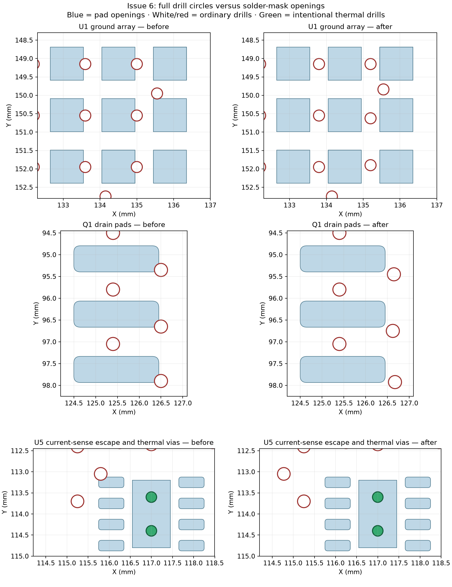
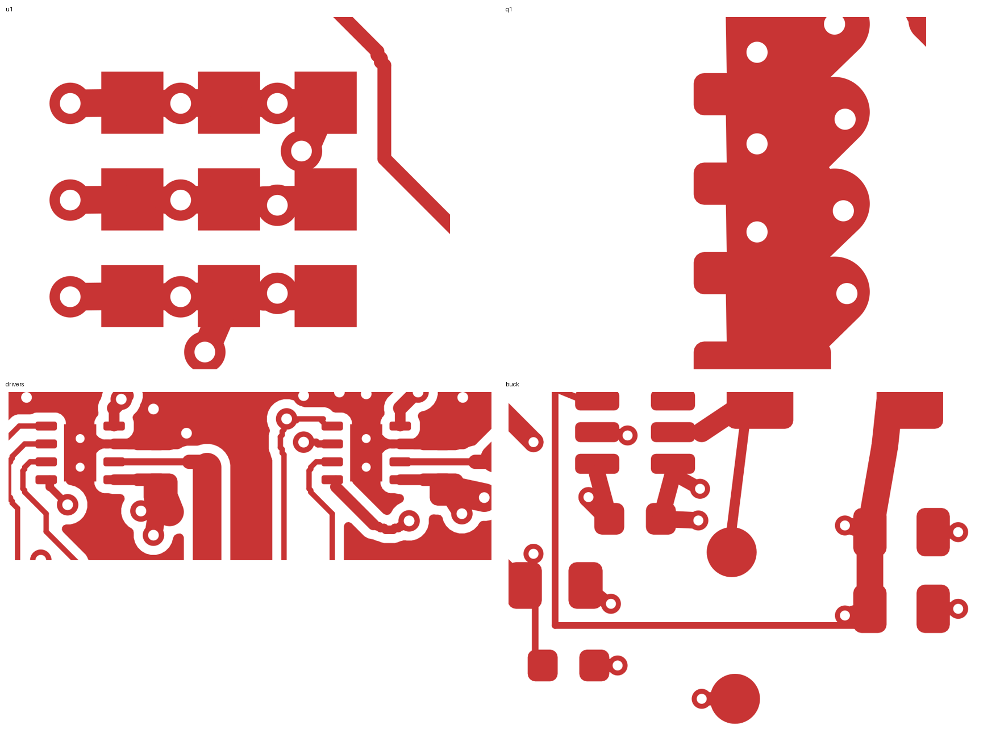

# Issue 6 completed — 2026-09-22

The earlier repair checked via centres, leaving 12 ordinary holes overlapping
pad openings. Another 23 vias had less than 0.10 mm edge clearance. This pass
moves all 35 locally: **zero unintended overlaps, 0.10 mm minimum clearance**
to every front/back pad mask and paste aperture.

All 2,228 existing track segments and all footprints are retained. There are
48 short connection segments (11.20 mm total); the via count stays at 247 and
all drill/diameter/net assignments are unchanged. The longest via move is
1.814 mm at R19 (GPIO47). The completed P3 GPIO48 route, USB traces, motor-output
trunks and local driver bypass tracks are unchanged.

The four 0.45/0.25 mm GND thermal vias under U4/U5 have **per-via filling and
capping enabled**, verified after saving/reopening. They remain under the
independent paste apertures. The drawing requires resin fill and copper cap,
IPC-4761 type VII; include this process in the fabrication order. Board-wide
fill/cap settings remain off. KiCad supports these settings per via; the earlier
note saying otherwise was incorrect. See the [KiCad 10 via documentation](https://docs.kicad.org/10.0/en/pcbnew/pcbnew.html)
and [JLCPCB via-covering guide](https://jlcpcb.com/help/article/pcb-via-covering).

The 0.10 mm clearance is this board's design allowance, not a manufacturer rule.
The new `Via drill to solder pad` DRC rule checks physical hole clearance even
on the same net. Its exception is limited to the specified thermal vias and
their own exposed-pad apertures. `via_openings.py` separately checks the actual
mask/paste shapes, includes unnumbered paste-only pads, and verifies fill/cap.

Validation:

- Final KiCad DRC after refilling and saving: zero unconnected items and zero
  schematic-parity issues; only the existing four J1 hole-clearance errors and
  U1 library-footprint warning remain. No new DRC violations.
- The new rule reports 36 additional violations on the prior board (including
  duplicate pad geometries) and none on the repaired board.
- Five regression tests pass: outside-centre drill overlap, tangency, rotated
  pads, rounded/oval pads, and paste-only apertures with mandatory fill/cap.
- The local repair replays to identical track/via geometry and is idempotent.
  The complete `rework.py` pass also reproduces the saved track/via geometry and
  footprint/pad geometry, and its final aperture audit passes.
- Native KiCad copper exports inspected for U1, Q1, the drivers and buck stage.

Files: `validation.json` records PCB hashes and preservation checks;
`aperture-audit.json` records nearest aperture clearance for every via;
`via-moves.csv` lists all moves; `drc.json` is the final KiCad report.

