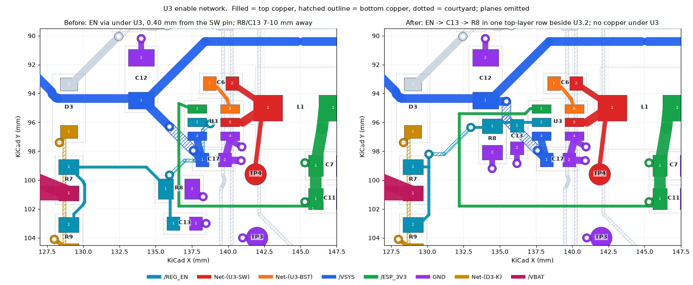
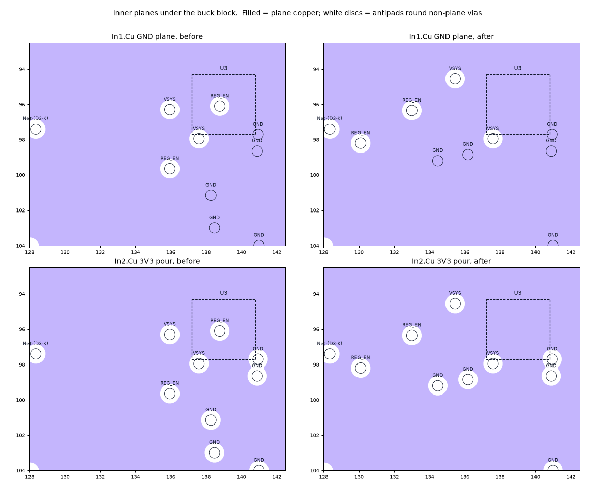

# REG_EN beside U3.2 — 2026-09-24

The last open item in CLAUDE.md's "Layout constraints". `REG_EN` is a ~20 kΩ
node sitting 1.2 V above the AP63203's EN comparator threshold. The rule for
it was:

> Put R8 and C13 physically next to U3.2 and run the long leg from R7/R9 into
> them, not the reverse.

The issue-5 buck block did the reverse:

- **FB fenced U3's west side.** The dedicated FB sense trace left U3.1 west
  and ran down x = 136.6, 0.5 mm from the west pins, then round the south of
  the block to C11. EN had no way out on top copper.
- **So EN left through a via under the package.** The via sat between the
  pin columns, **0.40 mm from the SW pin**. Issue 8 measured that and set the
  DRC floor just under it, at 0.35 mm.
- **The filter parts were far away.** R8 was 7.35 mm of copper from U3.2,
  straddling the FB trace. C13 was 9.9 mm away, below it.

## What changed (`tools/autoroute/reg_en.py`)

The stage runs in `rework.py` after `battery_bay.py`. Standalone, it
converts an existing board once. It asserts every item it replaces, so a
board that has drifted fails rather than being half-edited.

- **C13 and R8 stand vertical in a row just west of U3.** C13 is at
  (136.18, 97.0) and R8 at (134.47, 97.175), both rot 270, so pad 1 (REG_EN)
  is to the north.
  - U3.2 → C13.1 → R8.1 is one straight top-layer run along y = 96, with
    the filter capacitor first.
  - Their GND pads face south, and each has its own plane via.
  - C13's courtyard is 0.04 mm clear of U3's. R8's is 0.2 mm clear of C12's.
- **FB keeps its dedicated, via-free top-layer route to C11.1.** It now
  leaves U3.1 along y = 95.4, between C12 and the new parts, and turns south
  at x = 132.2 instead of 136.6. The run along y = 101.8 to C11 is unchanged.
- **The long leg takes the vias.** It leaves R8.1 west and drops to B.Cu at
  (133.0, 96.35), inside FB's turn. It crosses under FB and comes up beside
  R7 at (130.1, 98.2), then runs down x = 130.1 to R7.2 and R9.2 as before.
  The nearer via is 5.65 mm from switching copper, C6's BST pad.
- **VSYS.** The C12 → C17 hop moves its upper via north of FB, to
  (135.45, 94.55). The lower via at (137.6, 97.95) and its C17 stub stay.

### Why FB did not go to B.Cu instead

That was the first layout tried. It is shorter (FB 16.6 mm), and it leaves
REG_EN with no via at all. It passed DRC.

**It was dropped because a via on FB bonds to the In2 3V3 pour beside U3.**
The pour connects to every via of its own net, so FB would have sensed the
plane next to the regulator. That is the plane pickup review finding 5
removed: "take a quiet feedback sense from the output-capacitor node".
Keeping the pour off those vias would need keepout rule areas on In2, which
nothing checks: delete one and FB silently re-bonds to the plane.

`REG_EN` belongs to no plane, so its vias tie nothing to In1 or In2. It takes
the crossing instead.

### Plane antipads

Every new via is at least 1.35 mm from any other non-plane via. Each via's
antipad is 1.1 mm across, and that spacing keeps a 0.25 mm web of plane
between them. In the B.Cu-FB attempt, the FB via sat 1.0 mm from the VSYS
via, and their antipads merged into one 2 mm void in In1.

In1 directly under U3 is now unbroken: the old EN via's antipad sat between
the pin columns.

## Measurements (`measure.py`, `measurements.json`)

    python3 layout/reg-en/measure.py BEFORE.kicad_pcb AFTER.kicad_pcb [--json OUT]

| | before | after |
|---|---:|---:|
| `REG_EN` to SW/BST, U3's own pad included (= DRC) | **0.40 mm** (EN via under U3) | **0.95 mm** (U3.2 to U3.5) |
| `REG_EN` copper outside U3.2 to SW/BST | 0.40 mm | **1.875 mm** |
| `REG_EN` vias inside U3's courtyard | 1 | **0** |
| copper path U3.2 → C13.1 | 9.90 mm | **1.91 mm** |
| copper path U3.2 → R8.1 | 7.35 mm | **3.66 mm** |
| copper path U3.2 → R7.2 / R9.2 | 14.72 / 19.70 mm | 10.87 / 14.43 mm |
| `REG_EN` track (F.Cu + B.Cu), vias | 12.30 + 5.39 mm, 2 | 10.65 + 3.67 mm, 2 |
| `REG_EN` vias, nearest gap to SW/BST | 0.40 mm | **5.65 mm** |
| FB path U3.1 → C11.1 | 18.10 mm, F.Cu only, 0 vias | 26.28 mm, F.Cu only, 0 vias |
| FB to SW/BST | 1.35 mm | 1.35 mm |
| VSYS C12.1 → C17.1 | 5.91 mm, 2 vias | 6.65 mm, 2 vias |
| vias on the board | 253 | 253 |

**0.95 mm is U3's own EN-to-SW pin gap.** A TSOT-23-6 puts EN and SW
opposite each other across the package, so no layout can do better. The
number the layout controls, the nearest REG_EN copper outside that pad, is
the EN stub's end inside U3.2 at 1.875 mm.

The two gap figures that include U3's pad reproduce `clearmin.py`'s DRC result
exactly, which is the cross-check on the script's geometry.

## Rule

"REG_EN clear of the switch node" in `Pixy-M2.kicad_dru` goes from
**0.35 mm to 0.9 mm**, just under the package's 0.95 mm. The issue-8 floor
sat below the intent, at whatever the board happened to achieve. This one
sits at the physical limit: any REG_EN copper put back under U3 fails it.
DRC still cannot check the placement half of the rule, R8/C13 beside U3.2;
that remains a review item.

## Validation

- **DRC** (`drc.json`): `--schematic-parity --refill-zones` gives 0
  violations, 0 unconnected, 0 parity issues, with the new floor in place.
  The schematic is unchanged.
- **Aperture audit** (`aperture-audit.json`): `via_openings.py` passes with
  253 vias and a 0.10 mm minimum ordinary gap.
- **Exact clearances** (`clearances.json`, `clearmin.py`): REG_EN-SW goes
  0.40 → 0.95 mm. Every other guarded pair is unchanged:
  - REG_EN to motor: 7.75 mm;
  - IPROPI to motor: 0.53 mm;
  - VBUS/VSYS to SW: 1.11 mm;
  - USB to other nets: 0.20 mm;
  - VBAT_SENSE: > 20 mm.
- **Negative tests** (`negative-tests.json`). The new floor fires:
  - on the board before this pass: the EN via at 0.40 mm, and the stub into
    it at 0.60 / 0.675 / 0.775 mm;
  - on a copy with a REG_EN track run 1.2 mm under U3 toward SW: 0.675 mm.
- **Nothing else moved.** A track/via diff against the previous board
  touches only `/REG_EN`, `/ESP_3V3` (the FB run), `/VSYS` and the two GND
  stitches of R8/C13. Three reference fields moved: R8, C13, and C17, whose
  upright label sat where C13 now is.
- **Replay.** A full `rework.py` run from `base-routed.kicad_pcb` reproduces
  the board. Every footprint, track, via and text is identical after refill.
  The only differences are the random member UUIDs of the five silkscreen
  groups, and one vertex of the B.Cu pour fill. The fill's area is identical,
  5214.121 mm².

## Correction

Issue 5 recorded that FB "never comes within 2.1 mm of SW or BST". Its run
to C11 along y = 101.8 passes TP4, the SW probe pad, at **1.35 mm**. DRC gives
that figure on the board before and after this pass, and the run is
untouched.

## Costs

- **FB is 8.2 mm longer**, 18.1 → 26.3 mm. It is a sense line into the
  regulator's ~1 MΩ internal divider, so noise decides its route, not
  length. It now also runs beside C12 and the enable row, and neither of
  those switches.
- **REG_EN still has two vias.** Both are on the long leg, 5.65 mm or more
  from switching copper, where issue 5 had one under the package.
- **The R8 silkscreen label sits over the FB trace.** Vias and tracks are
  tented, and DRC's silkscreen checks pass.

## Files

| file | content |
|---|---|
| `measure.py` | the measurements above, before vs after |
| `measurements.json` | its output for the previous and current board |
| `clearances.json` | `clearmin.py` before and after |
| `drc.json` | final DRC with schematic parity |
| `aperture-audit.json` | `via_openings.py` on the final board |
| `negative-tests.json` | the new floor, fired on two broken boards |
| `reg-en.png` | top and bottom copper round U3, before and after |
| `planes.png` | In1 and In2 under the buck block, before and after |
